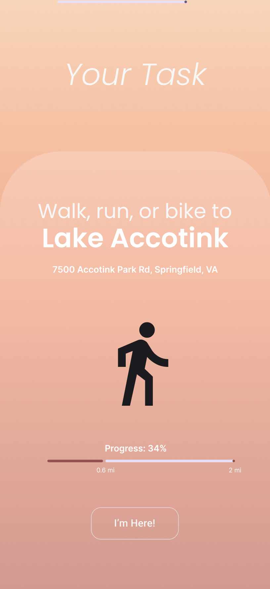
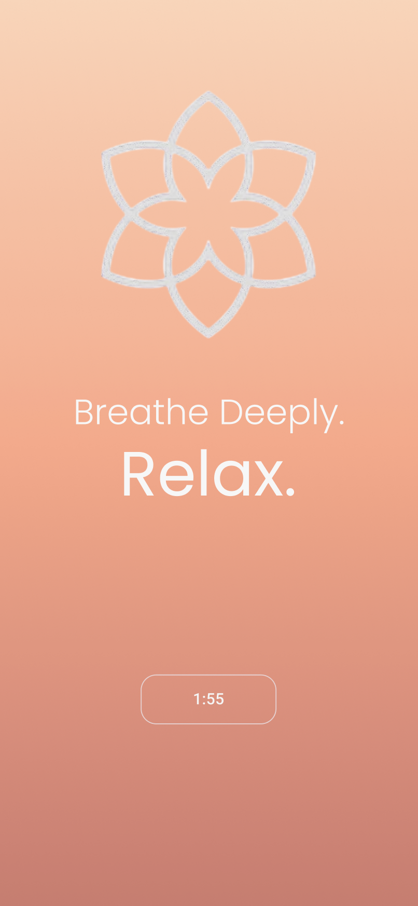

# 🧠 Ritual

## 📌 Overview
Ritual is a mental wellness app meant to make your day just a little bit brighter. Check in once a day for a few minutes and complete a task that will elevate your mood and improve your mental health. It's not a chore or an assignment, just a ritual!

---

## 🚀 Features
- ✅ Daily mood-lifting tasks
- ✅ Streaks for motivation
- ✅ Aesthetic interface and intuitive usage

---

## 🛠️ Technologies Used

| Area            | Stack/Tools                                   |
|-----------------|-----------------------------------------------|
| Backend         | Dart                                          |
| Frontend        | Flutter, GetX                                 |
| State Mngmnt    | GetStorage                                    |
| Other Tools     | Git, Figma                                    |

---

## 📷 Screenshots

<table>
  <tr>
    <td align="center">
      <br/>
    </td>
    <td align="center">
      <br/>
    </td>
  </tr>
</table>

---

## 🧪 How to Run Locally

```bash
# Clone repo
git clone https://github.com/IshanA2007/Ritual.git
cd ritual

# Get Flutter packages
flutter pub get

# Run the app
flutter run
